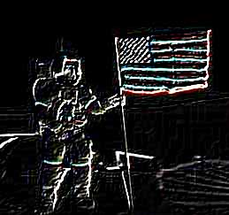

# Convolution Effect

The Convolution Effect allows you to produce a range of effects by specifying a set of convolution kernels. A simple explanation is given here but you may wish to refer to other sources for complete descriptions of convolution and how you can use it.

## Settings

| Name | Default | Description | 
| --- | --- | --- |
| Width | 3 pixels | The width of the filter to be applied. | 
| Height | 3 pixels | The height of the filter to be applied. | 
| X | 2 pixels | The horizontal center of the filter in pixels from top left. | 
| Y | 2 pixels | The vertical center of the filter in pixels from top left. | 
| Number | 2 | The number of kernels to apply. | 
| Values | See desc. | The values for the kernels in a comma delimited list. The items in the list may be integers or floating point numbers. The default value is: "-1,0,1,-2,0,2,-1,0,1,1,2,1,0,0,0,-1,-2,-1" | 

## Workings

Convolution is a general purpose filter effect for images. It works by determining the value of a central pixel by adding the weighted values of all its neighbors together. The weights applied to each pixel are determined by what is called a convolution kernel.

So if you want to take the average of all the immediate neighbors of a central pixel you would specify an equally weighted convolution kernel. Note that the total sum of all the weights is one so that the overall brightness of the image is not affected by the convolution. Note that the anchor point is highlighted to show which pixel should be regarded as central.

| 0.1111 | 0.1111 | 0.1111 | 
| --- | --- | --- |
| 0.1111 | 0.1112 | 0.1111 | 
| 0.1111 | 0.1111 | 0.1111 | 

If you wanted to take the average of the pixels immediately above, below and to the sides of the central pixel, and you wanted to exclude the central pixel itself, you would specify the following kernel.

| 0.0000 | 0.2500 | 0.0000 | 
| --- | --- | --- |
| 0.2500 | 0.0000 | 0.2500 | 
| 0.0000 | 0.2500 | 0.0000 | 

Although a three square kernel with the anchor at the center is most common, you can use other shapes of kernel. For example the following convolution will shift the entire image left by one pixel.

| 0.0000 | 1.0000 | 
| --- | --- |

When you specify values you specify them from left to right and then from top to bottom. You can specify more than one filter at a time and the results will be added together.

The default kernel is a standard Sobel edge detector. This contains two filters - one vertical, one horizontal - to be applied and then added together. The two kernel values are:

| -1 | 0 | 1 | 
| --- | --- | --- |
| -2 | 0 | 2 | 
| -1 | 0 | 1 | 

| 1 | 2 | 1 | 
| --- | --- | --- |
| 0 | 0 | 0 | 
| -1 | -2 | -1 | 

## Example

The following examples show the effect of the default kernel - a Sobel Edge Detector.

[C#]

```csharp
void function() {
  using (Doc doc = new Doc()) {
    AddImagePage(doc, img3); // original image
    doc.Rendering.Save("EffectConvolution.jpg");
    using (ImageLayer layer = AddImagePage(doc, img3)) {
      using (EffectOperation effect = new EffectOperation("Convolution")) {
        // the default is a Sobel Edge Detector
        effect.Apply(layer.PixMap);
      }
    }
    doc.Rendering.Save("EffectConvolutionDefault.jpg");
    using (ImageLayer layer = AddImagePage(doc, img3)) {
      using (EffectOperation effect = new EffectOperation("Convolution")) {
        // the following is a high intensity sharpen filter
        double[] k = new double[] { 0, -1, 0, -1, 5, -1, 0, -1, 0 };
        effect.Parameters["Number"].Value = 1;
        effect.Parameters["Values"].Values = k;
        effect.Apply(layer.PixMap);
      }
    }
    doc.Rendering.Save("EffectConvolutionSharpen.jpg");
  }
}
```

<span class=language>[Visual Basic]</span>
```vbnet
Sub ...
  Using doc As New Doc()
    AddImagePage(doc, img3)
    ' original image
    doc.Rendering.Save("EffectConvolution.jpg")
    Using layer As ImageLayer = AddImagePage(doc, img3)
      Using effect As New EffectOperation("Convolution")
        ' the default is a Sobel Edge Detector
        effect.Apply(layer.PixMap)
      End Using
    End Using
    doc.Rendering.Save("EffectConvolutionDefault.jpg")
    Using layer As ImageLayer = AddImagePage(doc, img3)
      Using effect As New EffectOperation("Convolution")
        ' the following is a high intensity sharpen filter
        Dim k As Double() = New Double() {0, -1, 0, -1, 5, -1, _
          0, -1, 0}
        effect.Parameters("Number").Value = 1
        effect.Parameters("Values").Values = k
        effect.Apply(layer.PixMap)
      End Using
    End Using
    doc.Rendering.Save("EffectConvolutionSharpen.jpg")
  End Using
End Sub
```

 Original Image

 After Convolution Applied