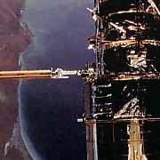
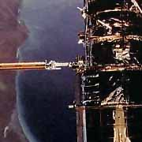

# Despeckle Effect

The Despeckle filter removes noise from images without blurring edges. It attempts to detect complex areas and leave these intact while smoothing areas where noise will be noticeable.

## Settings

| Name | Default | Description | 
| --- | --- | --- |
| Threshold | 20 | Threshold of complexity above which the image should not be smoothed. | 

## Workings

The Despeckle filter smoothes areas in which noise is noticeable while leaving complex areas untouched. The effect is that grain or other noise is reduced without severely affecting edges.

The standard deviation of each pixel and its neighbors is calculated to determine if the area is one of high complexity or low complexity. If the complexity is lower than the threshold then the area is smoothed using a simple mean filter.

## Example

The following examples show the effect of a Despeckle filter applied to a portion of detail from a picture of the Hubble Space Telescope. The image is characterized by a relatively smooth background but a complex foreground. The image is very grainy but the grain is obscured in areas of high complexity and is only really visible in the background.

[C#]

```csharp
void function() {
  using (Doc doc = new Doc()) {
    AddImagePage(doc, img4); // original image
    doc.Rendering.Save("EffectDespeckle.jpg");
    using (ImageLayer layer = AddImagePage(doc, img4)) {
      using (EffectOperation effect = new EffectOperation("Despeckle")) {
        effect.Parameters["Threshold"].Value = 10;
        effect.Apply(layer.PixMap);
      }
    }
    doc.Rendering.Save("EffectDespeckle10.jpg");
    using (ImageLayer layer = AddImagePage(doc, img4)) {
      using (EffectOperation effect = new EffectOperation("Despeckle")) {
        effect.Parameters["Threshold"].Value = 20;
        effect.Apply(layer.PixMap);
      }
    }
    doc.Rendering.Save("EffectDespeckle20.jpg");
    using (ImageLayer layer = AddImagePage(doc, img4)) {
      using (EffectOperation effect = new EffectOperation("Despeckle")) {
        effect.Parameters["Threshold"].Value = 30;
        effect.Apply(layer.PixMap);
      }
    }
    doc.Rendering.Save("EffectDespeckle30.jpg");
  }
}
```

<span class=language>[Visual Basic]</span>
```vbnet
Sub ...
  Using doc As New Doc()
    AddImagePage(doc, img4)
    ' original image
    doc.Rendering.Save("EffectDespeckle.jpg")
    Using layer As ImageLayer = AddImagePage(doc, img4)
      Using effect As New EffectOperation("Despeckle")
        effect.Parameters("Threshold").Value = 10
        effect.Apply(layer.PixMap)
      End Using
    End Using
    doc.Rendering.Save("EffectDespeckle10.jpg")
    Using layer As ImageLayer = AddImagePage(doc, img4)
      Using effect As New EffectOperation("Despeckle")
        effect.Parameters("Threshold").Value = 20
        effect.Apply(layer.PixMap)
      End Using
    End Using
    doc.Rendering.Save("EffectDespeckle20.jpg")
    Using layer As ImageLayer = AddImagePage(doc, img4)
      Using effect As New EffectOperation("Despeckle")
        effect.Parameters("Threshold").Value = 30
        effect.Apply(layer.PixMap)
      End Using
    End Using
    doc.Rendering.Save("EffectDespeckle30.jpg")
  End Using
End Sub
```

 Original Image

The sea is very grainy while the the grain is obscured in areas of high complexity like the telescope.

 Despeckle Radius 10

The sea has been appreciably degrained while retaining detail in areas of complexity.

 Despeckle Radius 20

The sea has been further degrained. Although the telescope remains unblurred, the coastline is becoming a little indistinct.

 Despeckle Radius 30

The telescope remains unblurred but now the coastline has lost a lot of distinction.