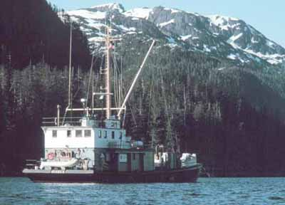
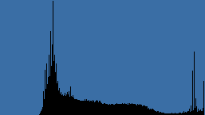

# Histogram Effect

Histogram is a image diagnostic rather than an image effect. When you apply the Histogram effect color levels are calculated and returned via the settings. The image is unaffected.

## Settings

| Name | Default | Description | 
| --- | --- | --- |
| Red | "" | A histogram of red levels as a comma delimited string. | 
| Green | "" | A histogram of green levels as a comma delimited string. | 
| Blue | "" | A histogram of blue levels as a comma delimited string. | 
| RGB | "" | A histogram of RGB levels as a comma delimited string. | 

## Workings

Image histograms show how color levels are distributed within an image. Each color channel has a value between 0 and 255 and the histogram simply returns the number of pixels with each of these values. A light image will have many values at the higher end of the histogram while a dark one will have many values at the lower end.

After the Histogram effect has been applied to an image the settings contain the histograms of each of the color channels and also of a combined RGB channel. These values are held as comma delimited strings.

## Example

The following example images show the effect of Histogram..

[C#]

```csharp
void function() {
  using (Doc doc = new Doc()) {
    AddImagePage(doc, img1); // original image
    doc.Rendering.Save("EffectHistogram.jpg");
    using (ImageLayer layer = AddImagePage(doc, img1)) {
      using (EffectOperation effect = new EffectOperation("Histogram")) {
        effect.Apply(layer.PixMap);
        var pars = effect.Parameters;
        doc.Color.SetRgb(255, 0, 0);
        DrawGraph(doc, pars["Red"].Values);
        doc.Color.SetRgb(0, 255, 0);
        DrawGraph(doc, pars["Green"].Values);
        doc.Color.SetRgb(0, 0, 255);
        DrawGraph(doc, pars["Blue"].Values);
      }
    }
    doc.Rendering.Save("EffectHistogramGraph.jpg");
  }
}

private void DrawGraph(Doc doc, double[] values) {
  double max = 0;
  for (int i = 0; i < values.Length; i++)
    max = Math.Max(max, values[i]);
  double[] points = new double[values.Length * 2];
  for (int i = 0; i < values.Length; i++) {
    double x = i * (doc.Rect.Width / values.Length);
    double y = values[i] * (doc.Rect.Height / max);
    points[(i * 2) + 0] = x;
    points[(i * 2) + 1] = y;
  }
  doc.AddPoly(points, false);
}
```

<span class=language>[Visual Basic]</span>
```vbnet
Sub ...
  Using doc As New Doc()
    AddImagePage(doc, img1)
    ' original image
    doc.Rendering.Save("EffectHistogram.jpg")
    Using layer As ImageLayer = AddImagePage(doc, img1)
      Using effect As New EffectOperation("Histogram")
        effect.Apply(layer.PixMap)
        Dim pars = effect.Parameters
        doc.Color.SetRgb(255, 0, 0)
        DrawGraph(doc, pars("Red").Values)
        doc.Color.SetRgb(0, 255, 0)
        DrawGraph(doc, pars("Green").Values)
        doc.Color.SetRgb(0, 0, 255)
        DrawGraph(doc, pars("Blue").Values)
      End Using
    End Using
    doc.Rendering.Save("EffectHistogramGraph.jpg")
  End Using
End Sub

Private Sub DrawGraph(doc As Doc, values As Double())
  Dim max As Double = 0
  For i As Integer = 0 To values.Length - 1
    max = Math.Max(max, values(i))
  Next
  Dim points As Double() = New Double(values.Length * 2 - 1) {}
  For i As Integer = 0 To values.Length - 1
    Dim x As Double = i * (doc.Rect.Width / values.Length)
    Dim y As Double = values(i) * (doc.Rect.Height / max)
    points((i * 2) + 0) = x
    points((i * 2) + 1) = y
  Next
  doc.AddPoly(points, False)
End Sub
```

 Original Image


                  Histogram of Red Intensities
                  Histogram of Green Intensities 
                  Histogram of Blue Intensities 
                  Histogram of RGB Intensities
                  Note that the photograph is unbalanced with little color at the dark end of the spectrum.

The actual values held in each of the settings and used to produce these graphs are given below.

Red = "0,0,0,0,0,0,0,0,0,0,0,0,0,0,0,0,0,0,0,0,0,0,0,0,0,0,1,2,1,1,2,1,1,2,2,3,9,9,19,14,25, 26,32,48,47,92,101,140,190,251,372,455,580,883,1304,1442,3397,2252,3638,5184,3402, 3244,2442,2754,2177,2217,1603,1776,1258,1273,1169,1030,1071,1009,953,1005,1005, 971,1002,998,"

Green = "0,0,0,0,0,0,0,0,0,0,0,0,0,0,0,0,0,0,0,0,0,0,1,0,0,0,2,1,5,5,5,7,15,30,40,75,167, 208,794,550,1373,969,1640,2007,1857,1907,4072,2507, 1964,2528,1616,1844,1384,1111, 1027,901,1006,1013,886,812,699,736,761,804,672,753,625,689,705,626,657,783,630,780, 692,791,719,666"

Blue = "0,0,0,0,0,0,0,0,0,0,0,0,0,0,0,0,0,0,0,0,0,0,0,0,0,0,0,0,0,0,0,0,0,0,0,1,1,1,1,0,0,3,4,7,9, 14,23,41,57,85,126,182,257,348,905,622,1711,1013,1940,1183,1438,2258,1481,3128,1837, 2640,4221,2013,2266,1618,1941,1207,1300,932,1020,840,890,784,801,742,757,873,749,797"

RGB = "0,0,0,0,0,0,0,0,0,0,0,0,0,0,0,0,0,0,0,0,0,0,0,0,0,0,1,1,2,2,2,2,5,10,14,26,59,72,271,188, 466,332,558,687,637,671,1398,896,737,954,704,827,740,780,1078,988,2038,1426,2154,2393, 1846,2079,1561,2228,1562,1870,2149,1492,1409,1172,1255,1006,1000,907,888,878,871,807"