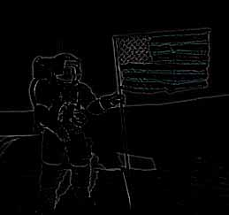
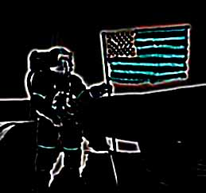
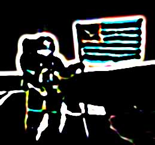

# Laplacian Effect

The Laplacian filter is used for detection of edges in an image. It highlights areas in which intensity changes rapidly producing a picture of all the edges in an image.

## Settings

| Name | Default | Description | 
| --- | --- | --- |
| Radius | 0.8 pixels | This value determines the size of the edges that are detected. This value represents the standard deviation of the Laplacian of Gaussian function. | 

## Workings

The Laplacian filter is a standard Laplacian of Gaussian convolution. This is a second derivative function designed to measure changes in intensity without being overly sensitive to noise. The function produces a peak at the start of the change in intensity and then at the end of the change.

Because the Laplacian of Gaussian produces a fairly wide convolution for a small radius this filter can become quite computationally expensive as radius is increased.

## Example

The following examples show the effect of a Laplacian filter applied with a number of different settings.

[C#]

```csharp
void function() {
  using (Doc doc = new Doc()) {
    AddImagePage(doc, img3); // original image
    doc.Rendering.Save("EffectLaplacian.jpg");
    using (ImageLayer layer = AddImagePage(doc, img3)) {
      using (EffectOperation effect = new EffectOperation("Laplacian")) {
        effect.Parameters["Radius"].Value = 0.8;
        effect.Apply(layer.PixMap);
      }
    }
    doc.Rendering.Save("EffectLaplacian08.jpg");
    using (ImageLayer layer = AddImagePage(doc, img3)) {
      using (EffectOperation effect = new EffectOperation("Laplacian")) {
        effect.Parameters["Radius"].Value = 1.6;
        effect.Apply(layer.PixMap);
      }
    }
    doc.Rendering.Save("EffectLaplacian16.jpg");
    using (ImageLayer layer = AddImagePage(doc, img3)) {
      using (EffectOperation effect = new EffectOperation("Laplacian")) {
        effect.Parameters["Radius"].Value = 3.2;
        effect.Apply(layer.PixMap);
      }
    }
    doc.Rendering.Save("EffectLaplacian32.jpg");
  }
}
```

<span class=language>[Visual Basic]</span>
```vbnet
Sub ...
  Using doc As New Doc()
    AddImagePage(doc, img3)
    ' original image
    doc.Rendering.Save("EffectLaplacian.jpg")
    Using layer As ImageLayer = AddImagePage(doc, img3)
      Using effect As New EffectOperation("Laplacian")
        effect.Parameters("Radius").Value = 0.8
        effect.Apply(layer.PixMap)
      End Using
    End Using
    doc.Rendering.Save("EffectLaplacian08.jpg")
    Using layer As ImageLayer = AddImagePage(doc, img3)
      Using effect As New EffectOperation("Laplacian")
        effect.Parameters("Radius").Value = 1.6
        effect.Apply(layer.PixMap)
      End Using
    End Using
    doc.Rendering.Save("EffectLaplacian16.jpg")
    Using layer As ImageLayer = AddImagePage(doc, img3)
      Using effect As New EffectOperation("Laplacian")
        effect.Parameters("Radius").Value = 3.2
        effect.Apply(layer.PixMap)
      End Using
    End Using
    doc.Rendering.Save("EffectLaplacian32.jpg")
  End Using
End Sub
```

## &nbsp;

 Original Image before Laplacian Filter

 Laplacian Radius 0.8 Pixels

 Laplacian Radius 1.6 Pixels

 Laplacian Radius 3.2 Pixels