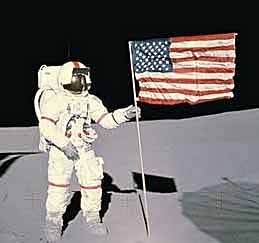
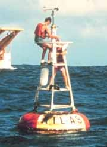
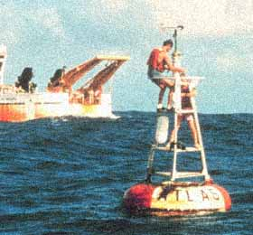
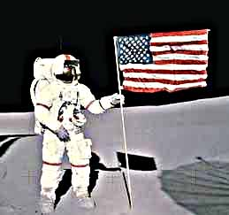

# Unsharp Mask Effect

The Unsharp Mask filter is a simple method of sharpening a photo. Areas of complexity and fine detail within the image become crisp and better defined. An Unsharp Mask takes longer to perform than a simple Sharpen but gives more control and produces a more natural appearance.

## Settings

| Name | Default | Description | 
| --- | --- | --- |
| Radius | 1.5 pixels | Determines the scale of fine detail that will be enhanced. Low values enhance only very fine detail while high values enhance larger levels of detail. | 
| Amount | 60 % | The level of enhancement to be applied to the fine detail. Values greater than 100% will super-enhance any complex areas. | 
| Threshold | 0 | If there is little fine detail then you can choose not to enhance it by setting a threshold. Any detail less than the threshold will not be enhanced. | 

## Workings

An Unsharp Mask is essentially a Blur in reverse. A Gaussian Blur is applied to a copy of the original image to produce an image with no fine detail. The blurred image is subtracted from the original to extract the fine detail. This fine detail is then added to the original image to highlight complex areas.

The radius parameter determines the radius of the Gaussian Blur in pixels and lets you choose the level of scale of detail that should be enhanced. The difference between color levels on the blurred and original image is determined at each point on the image. If the difference is greater than the Threshold parameter then the Amount percentage of the difference is added back to the original image.

## Example

The following example shows the basic effect of Unsharp Mask on a blurred photo and how the parameters can change the effect produced. Note that because JPEG compression has been used to compress these images some of the fine detail applied by the effect is not visible.

[C#]

```csharp
void function() {
  using (Doc doc = new Doc()) {
    AddImagePage(doc, img5); // original image
    doc.Rendering.Save("EffectUnsharpMask1a.jpg");
    using (ImageLayer layer = AddImagePage(doc, img5)) {
      using (EffectOperation effect = new EffectOperation("Unsharp Mask")) {
        effect.Apply(layer.PixMap);
      }
    }
    doc.Rendering.Save("EffectUnsharpMask1b.jpg");
    AddImagePage(doc, img3); // original image
    doc.Rendering.Save("EffectUnsharpMask2a.jpg");
    using (ImageLayer layer = AddImagePage(doc, img3)) {
      using (EffectOperation effect = new EffectOperation("Unsharp Mask")) {
        effect.Apply(layer.PixMap);
      }
    }
    doc.Rendering.Save("EffectUnsharpMask2b.jpg");
    AddImagePage(doc, img6); // original image
    doc.Rendering.Save("EffectUnsharpMask3a.jpg");
    using (ImageLayer layer = AddImagePage(doc, img6)) {
      using (EffectOperation effect = new EffectOperation("Unsharp Mask")) {
        effect.Apply(layer.PixMap);
      }
    }
    doc.Rendering.Save("EffectSharpen3b.jpg");
    using (ImageLayer layer = AddImagePage(doc, img3)) {
      using (EffectOperation effect = new EffectOperation("Unsharp Mask")) {
        effect.Parameters["Amount"].Value = 140;
        effect.Apply(layer.PixMap);
      }
    }
    doc.Rendering.Save("EffectUnsharpMaskSetting1.jpg");
    using (ImageLayer layer = AddImagePage(doc, img3)) {
      using (EffectOperation effect = new EffectOperation("Unsharp Mask")) {
        effect.Parameters["Amount"].Value = 140;
        effect.Parameters["Radius"].Value = 6;
        effect.Apply(layer.PixMap);
      }
    }
    doc.Rendering.Save("EffectUnsharpMaskSetting2.jpg");
    using (ImageLayer layer = AddImagePage(doc, img3)) {
      using (EffectOperation effect = new EffectOperation("Unsharp Mask")) {
        effect.Parameters["Amount"].Value = 140;
        effect.Parameters["Radius"].Value = 6;
        effect.Parameters["Threshold"].Value = 40;
        effect.Apply(layer.PixMap);
      }
    }
    doc.Rendering.Save("EffectUnsharpMaskSetting3.jpg");
  }
}
```

<span class=language>[Visual Basic]</span>
```vbnet
Sub ...
  Using doc As New Doc()
    AddImagePage(doc, img5)
    ' original image
    doc.Rendering.Save("EffectUnsharpMask1a.jpg")
    Using layer As ImageLayer = AddImagePage(doc, img5)
      Using effect As New EffectOperation("Unsharp Mask")
        effect.Apply(layer.PixMap)
      End Using
    End Using
    doc.Rendering.Save("EffectUnsharpMask1b.jpg")
    AddImagePage(doc, img3)
    ' original image
    doc.Rendering.Save("EffectUnsharpMask2a.jpg")
    Using layer As ImageLayer = AddImagePage(doc, img3)
      Using effect As New EffectOperation("Unsharp Mask")
        effect.Apply(layer.PixMap)
      End Using
    End Using
    doc.Rendering.Save("EffectUnsharpMask2b.jpg")
    AddImagePage(doc, img6)
    ' original image
    doc.Rendering.Save("EffectUnsharpMask3a.jpg")
    Using layer As ImageLayer = AddImagePage(doc, img6)
      Using effect As New EffectOperation("Unsharp Mask")
        effect.Apply(layer.PixMap)
      End Using
    End Using
    doc.Rendering.Save("EffectSharpen3b.jpg")
    Using layer As ImageLayer = AddImagePage(doc, img3)
      Using effect As New EffectOperation("Unsharp Mask")
        effect.Parameters("Amount").Value = 140
        effect.Apply(layer.PixMap)
      End Using
    End Using
    doc.Rendering.Save("EffectUnsharpMaskSetting1.jpg")
    Using layer As ImageLayer = AddImagePage(doc, img3)
      Using effect As New EffectOperation("Unsharp Mask")
        effect.Parameters("Amount").Value = 140
        effect.Parameters("Radius").Value = 6
        effect.Apply(layer.PixMap)
      End Using
    End Using
    doc.Rendering.Save("EffectUnsharpMaskSetting2.jpg")
    Using layer As ImageLayer = AddImagePage(doc, img3)
      Using effect As New EffectOperation("Unsharp Mask")
        effect.Parameters("Amount").Value = 140
        effect.Parameters("Radius").Value = 6
        effect.Parameters("Threshold").Value = 40
        effect.Apply(layer.PixMap)
      End Using
    End Using
    doc.Rendering.Save("EffectUnsharpMaskSetting3.jpg")
  End Using
End Sub
```

## &nbsp;

 Original Image

 Unsharp Mask Default Settings

 Original Image

 Unsharp Mask Default Settings

 Original Image

 Unsharp Mask Default Settings

The following examples show how the parameters can change the effect produced.

 Unsharp Mask Default Settings

 Unsharp Mask Amount =140

 Unsharp Mask Amount =140 Radius = 6

 Unsharp Mask Amount =140 Radius = 6 Threshold = 40