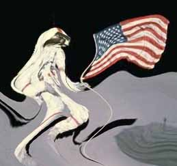
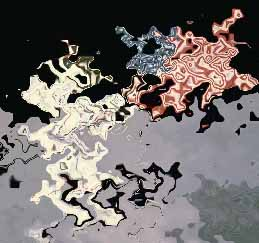
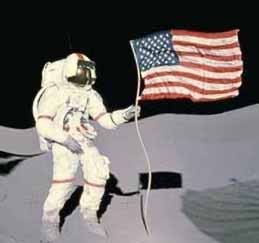

# Wave Effect

The Wave effect distorts the image as if it had been disturbed by a number of random waves.

## Settings

| Name | Default | Description | 
| --- | --- | --- |
| Number | 3 | The number of random waves that should be generated. | 
| LengthMin | 40 pixels | The minimum wavelength for a random wave. | 
| LengthMax | 60 pixels | The maximum wavelength for a random wave. | 
| HeightMin | 5 pixels | The minimum amplitude for a random wave. | 
| HeightMax | 15 pixels | The maximum amplitude for a random wave. | 
| Speed | 6 | There is a general speed versus quality tradeoff. Higher values produce faster results at the expense of quality. | 

## Workings

The effect distorts the image as if it had been disturbed by a number of waves. By choosing appropriate values you can make images look like they are underwater or are being seen through a heat haze.

## Example

The following examples show the effect of a Wave applied with a number of different settings.

[C#]

```csharp
void function() {
  using (Doc doc = new Doc()) {
    AddImagePage(doc, img3); // original image
    doc.Rendering.Save("EffectWave.jpg");
    using (ImageLayer layer = AddImagePage(doc, img3)) {
      using (EffectOperation effect = new EffectOperation("Wave")) {
        effect.Apply(layer.PixMap);
      }
    }
    doc.Rendering.Save("EffectWaveDefault.jpg");
    using (ImageLayer layer = AddImagePage(doc, img3)) {
      using (EffectOperation effect = new EffectOperation("Wave")) {
        effect.Parameters["LengthMin"].Value = 15;
        effect.Parameters["LengthMax"].Value = 30;
        effect.Apply(layer.PixMap);
      }
    }
    doc.Rendering.Save("EffectWaveLength.jpg");
    using (ImageLayer layer = AddImagePage(doc, img3)) {
      using (EffectOperation effect = new EffectOperation("Wave")) {
        effect.Parameters["HeightMin"].Value = 0;
        effect.Parameters["HeightMax"].Value = 5;
        effect.Apply(layer.PixMap);
      }
    }
    doc.Rendering.Save("EffectWaveHeight.jpg");
  }
}
```

<span class=language>[Visual Basic]</span>
```vbnet
Sub ...
  Using doc As New Doc()
    AddImagePage(doc, img3)
    ' original image
    doc.Rendering.Save("EffectWave.jpg")
    Using layer As ImageLayer = AddImagePage(doc, img3)
      Using effect As New EffectOperation("Wave")
        effect.Apply(layer.PixMap)
      End Using
    End Using
    doc.Rendering.Save("EffectWaveDefault.jpg")
    Using layer As ImageLayer = AddImagePage(doc, img3)
      Using effect As New EffectOperation("Wave")
        effect.Parameters("LengthMin").Value = 15
        effect.Parameters("LengthMax").Value = 30
        effect.Apply(layer.PixMap)
      End Using
    End Using
    doc.Rendering.Save("EffectWaveLength.jpg")
    Using layer As ImageLayer = AddImagePage(doc, img3)
      Using effect As New EffectOperation("Wave")
        effect.Parameters("HeightMin").Value = 0
        effect.Parameters("HeightMax").Value = 5
        effect.Apply(layer.PixMap)
      End Using
    End Using
    doc.Rendering.Save("EffectWaveHeight.jpg")
  End Using
End Sub
```

 Original Image before Wave

 After Wave with default settings

 LengthMin = 15, LengthMax = 30

 HeightMin = 0, HeightMax = 5